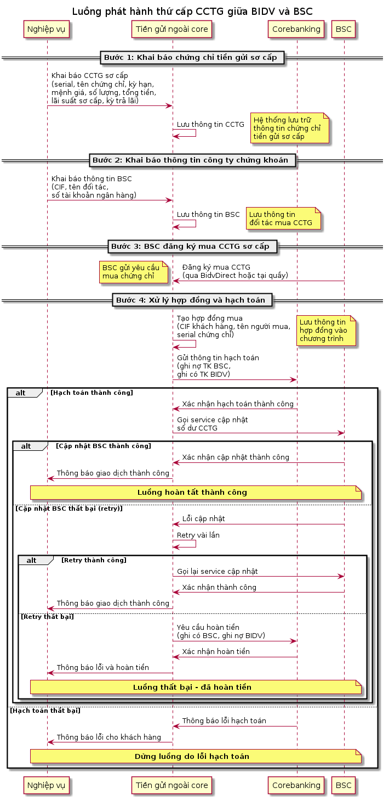

# Biểu đồ Sequence - Luồng phát hành CCTG BIDV-BSC

Module này chứa biểu đồ sequence mô tả luồng phát hành thứ cấp chứng chỉ tiền gửi (CCTG) giữa BIDV và BSC.

## Mô tả luồng nghiệp vụ

### Các đối tượng tham gia
- **Nghiệp vụ**: Bộ phận nghiệp vụ của BIDV
- **Tiền gửi ngoài core**: Hệ thống quản lý tiền gửi bên ngoài core banking
- **Corebanking**: Hệ thống core banking của BIDV
- **BSC**: Công ty chứng khoán Bảo Việt

### Các bước xử lý

#### Bước 1: Khai báo chứng chỉ tiền gửi sơ cấp
Nghiệp vụ khai báo thông tin chứng chỉ tiền gửi sơ cấp trên hệ thống Tiền gửi ngoài core, bao gồm:
- Serial chứng chỉ
- Tên chứng chỉ tiền gửi
- Kỳ hạn sơ cấp
- Mệnh giá
- Số lượng
- Tổng số tiền
- Lãi suất sơ cấp
- Kỳ trả lãi

#### Bước 2: Khai báo thông tin công ty chứng khoán
Nghiệp vụ khai báo thông tin công ty chứng khoán mua CCTG sơ cấp, bao gồm:
- CIF khách hàng
- Tên đối tác
- Số tài khoản ngân hàng

#### Bước 3: BSC đăng ký mua CCTG sơ cấp
BSC thực hiện đăng ký mua CCTG sơ cấp thông qua:
- Online qua BidvDirect, hoặc
- Tại quầy giao dịch

#### Bước 4: Xử lý hợp đồng và hạch toán
Hệ thống Tiền gửi ngoài core:
1. Tạo hợp đồng mua với thông tin:
   - CIF khách hàng mua
   - Tên người mua
   - Serial chứng chỉ tiền gửi
2. Gửi thông tin sang Corebanking để hạch toán:
   - Ghi nợ tài khoản BSC
   - Ghi có tài khoản BIDV

#### Xử lý các trường hợp ngoại lệ:

**Trường hợp hạch toán lỗi:**
- Thông báo lỗi cho khách hàng
- Dừng luồng xử lý

**Trường hợp hạch toán thành công:**
- Gọi service BSC để cập nhật số dư chứng chỉ tiền gửi
- Nếu cập nhật BSC lỗi: retry vài lần
- Nếu retry vẫn không thành công: hoàn tiền (ghi có BSC, ghi nợ BIDV)

## Cách sử dụng

### Yêu cầu hệ thống
- Java 8+
- Maven 3.6+
- PlantUML (được tích hợp qua Maven plugin)

### Tạo biểu đồ
```bash
# Di chuyển vào thư mục module
cd sequence-diagrams-bidv-bsc

# Tạo biểu đồ từ PlantUML bằng CLI
plantuml -tpng -charset UTF-8 src/main/plantuml/bidv-bsc-cctg-sequence.puml
mv src/main/plantuml/bidv-bsc-cctg-sequence.png docs/images/
```

### Xem biểu đồ
Sau khi chạy lệnh trên, biểu đồ sẽ được tạo tại: `docs/images/bidv-bsc-cctg-sequence.png`



## Cấu trúc thư mục
```
sequence-diagrams-bidv-bsc/
├── src/main/plantuml/          # Mã nguồn PlantUML
│   └── bidv-bsc-cctg-sequence.puml
├── docs/images/                # Biểu đồ được tạo ra
│   └── bidv-bsc-cctg-sequence.png
├── pom.xml                     # Cấu hình Maven
└── README.md                   # Tài liệu này
```

## Công nghệ sử dụng
- **PlantUML**: Tạo biểu đồ sequence từ text
- **Maven PlantUML Plugin**: Tự động tạo biểu đồ trong quá trình build

## Lưu ý
- Biểu đồ được viết bằng tiếng Việt để dễ hiểu với đội ngũ phát triển
- Các trường hợp ngoại lệ được mô tả chi tiết trong biểu đồ
- Có thể mở rộng để thêm các luồng nghiệp vụ khác của ngành ngân hàng